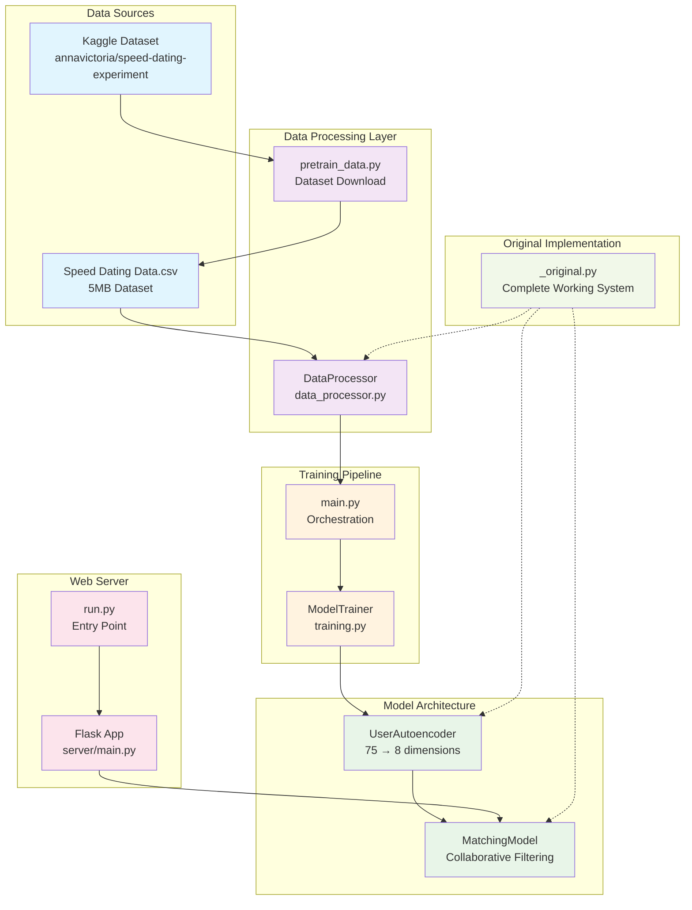
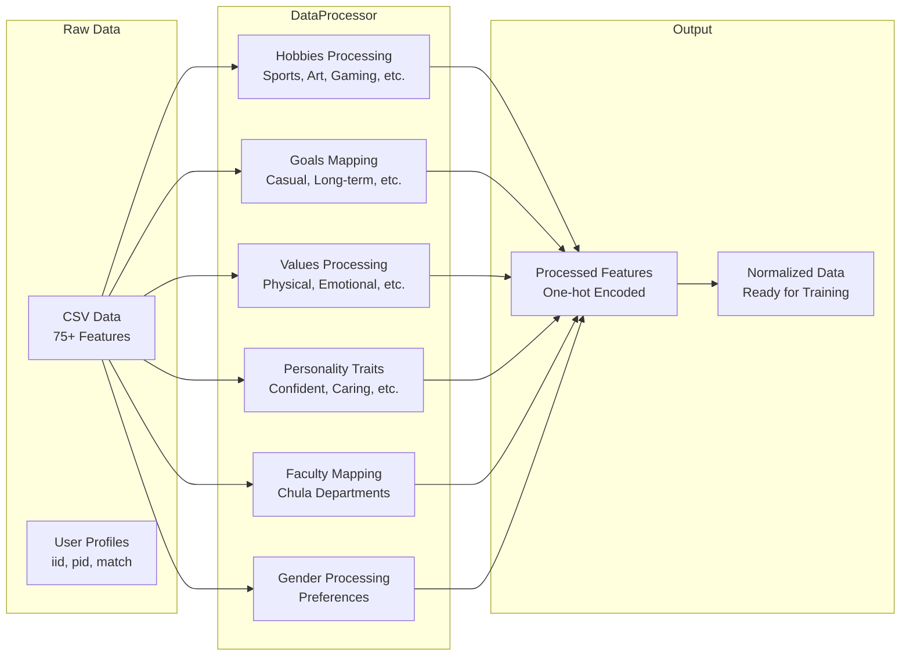
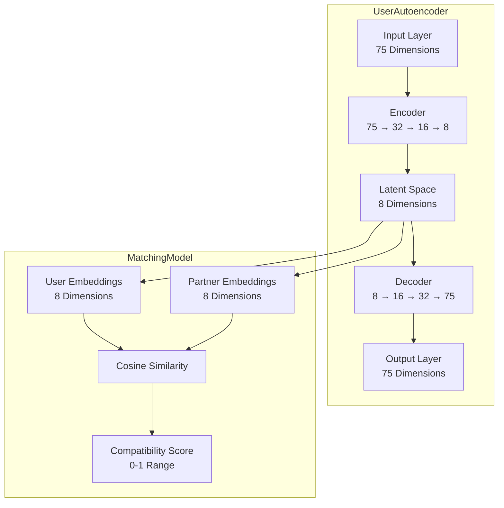
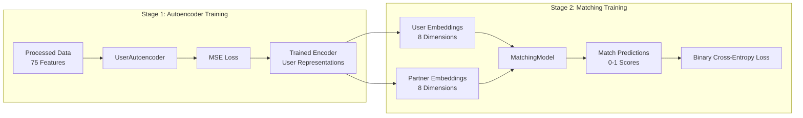
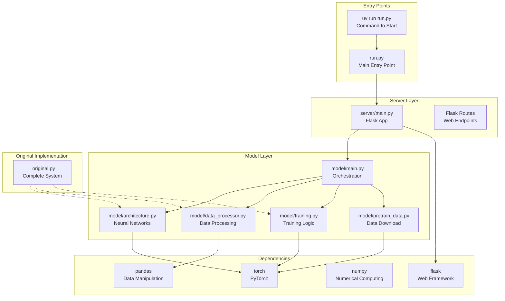
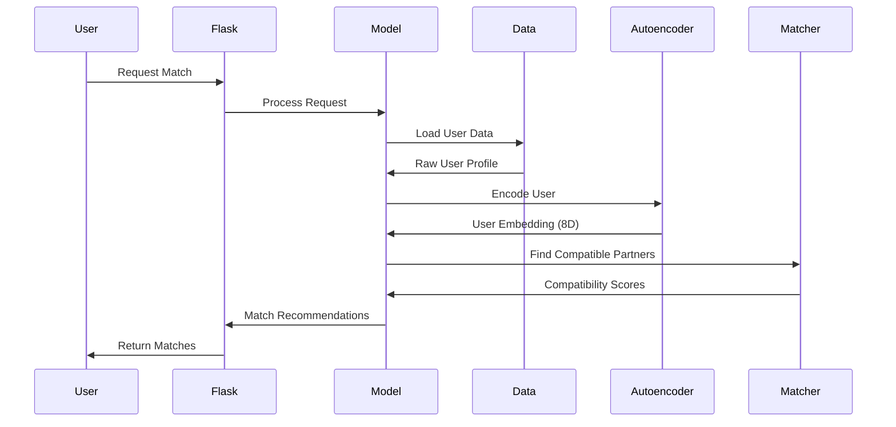

# Cupid Matchmaker - System Architecture Diagram

## Overall System Flow

## Detailed Component Architecture

### 1. Data Processing Pipeline

### 2. Neural Network Architecture

### 3. Training Pipeline

### 4. File Structure & Dependencies

### 5. Data Flow Overview

## Key Features

### Data Processing Features

- **75+ Input Features**: Hobbies, goals, values, personality, faculty, gender
- **Chula-Specific**: Faculty mapping for Chulalongkorn University students
- **Categorical Encoding**: One-hot encoding for all categorical features
- **Normalization**: Age and numerical features normalized to 0-1 range

### Model Features

- **Two-Stage Architecture**: Autoencoder + Collaborative Filtering
- **Dimensionality Reduction**: 75 → 8 dimensions for efficient matching
- **Cosine Similarity**: For compatibility scoring
- **Real-time Matching**: Fast inference for user recommendations

### System Features

- **Modular Design**: Clean separation of concerns
- **Flask Web Server**: RESTful API endpoints
- **PyTorch Backend**: Modern deep learning framework
- **Development Ready**: Complete working implementation in `_original.py`

## Technology Stack

- **Backend**: Python 3.13+, Flask 3.1.0
- **ML Framework**: PyTorch 2.7.1
- **Data Processing**: Pandas, NumPy 2.3.0
- **Package Management**: uv (Astral)
- **Development**: Jupyter Notebooks for analysis

This architecture enables efficient, scalable matching for Chula students with a modern web interface and robust machine learning backend.
