# 💘 Cupid Matchmaker

The best matchmaker for Chulalongkorn University students! This AI-powered dating app uses neural networks to find compatible matches based on speed dating data.

## 🚀 Features

- **Neural Network Matching**: Uses autoencoder and collaborative filtering for accurate compatibility prediction
- **Chula-Specific**: Faculty mapping for Chulalongkorn University students
- **Web Interface**: Beautiful Flask web app for easy interaction
- **Real-time Training**: Train models directly through the web interface
- **Smart Matching**: Find top-k compatible partners for any user

## 🛠️ Setup

### Prerequisites

1. Install `uv`: [docs.astral.sh/uv/getting-started/installation](https://docs.astral.sh/uv/getting-started/installation/)

2. Install dependencies:

```bash
uv sync
```

## 🎯 Usage

### Start the Web Application

```bash
uv run run.py
```

Then open your browser to `http://localhost:5003`

### Web Interface Features

1. **Train Models**: Click "Train Models" to download the speed dating dataset and train the neural networks
2. **Find Matches**: Enter a user ID to find their top compatible matches
3. **Check Status**: Monitor model training and loading status

### Programmatic Usage

```python
from cupid.model.main import CupidMatchmaker

# Initialize and train
matchmaker = CupidMatchmaker()
processed_data = matchmaker.load_and_process_data()
features_tensor, df = matchmaker.prepare_training_data(processed_data)
matchmaker.train_models(features_tensor, df)
matchmaker.save_models()

# Get matches
matches = matchmaker.get_matches(user_id=123, top_k=5)
print(f"Top matches: {matches}")
```

## 🏗️ Architecture

## Overall System Flow


## Key Features

### Data Processing Features

- **75+ Input Features**: Hobbies, goals, values, personality, faculty, gender
- **Chula-Specific**: Faculty mapping for Chulalongkorn University students
- **Categorical Encoding**: One-hot encoding for all categorical features
- **Normalization**: Age and numerical features normalized to 0-1 range


### Model Features

- **Two-Stage Architecture**: Autoencoder + Collaborative Filtering
- **Dimensionality Reduction**: 75 → 8 dimensions for efficient matching
- **Cosine Similarity**: For compatibility scoring
- **Real-time Matching**: Fast inference for user recommendations

### System Features

- **Modular Design**: Clean separation of concerns
- **Flask Web Server**: RESTful API endpoints
- **PyTorch Backend**: Modern deep learning framework
- **Development Ready**: Complete working implementation in `_original.py`

### Data Processing Pipeline

- **75+ Features**: Hobbies, goals, values, personality, faculty, gender
- **Chula Faculty Mapping**: Maps field codes to Chulalongkorn University faculties
- **One-hot Encoding**: Converts categorical features to numerical format
- **Normalization**: Scales numerical features to 0-1 range

### Neural Network Models

- **UserAutoencoder**: 75 → 32 → 16 → 8 dimensions (compresses user profiles)
- **MatchingModel**: Collaborative filtering with cosine similarity
- **Two-stage Training**: Autoencoder first, then matching model

#### Neural Network Architecture

```mermaid
graph TB
    subgraph "UserAutoencoder"
        A1[Input Layer<br/>75 Dimensions]
        A2[Encoder<br/>75 → 32 → 16 → 8]
        A3[Latent Space<br/>8 Dimensions]
        A4[Decoder<br/>8 → 16 → 32 → 75]
        A5[Output Layer<br/>75 Dimensions]
    end

    subgraph "MatchingModel"
        B1[User Embeddings<br/>8 Dimensions]
        B2[Partner Embeddings<br/>8 Dimensions]
        B3[Cosine Similarity]
        B4[Compatibility Score<br/>0-1 Range]
    end

    A1 --> A2
    A2 --> A3
    A3 --> A4
    A4 --> A5
    A3 --> B1
    A3 --> B2
    B1 --> B3
    B2 --> B3
    B3 --> B4
```


#### Training Pipeline


### Web Server

- **Flask App**: RESTful API with beautiful web interface
- **Real-time Training**: Train models through web interface
- **Match Prediction**: Get compatibility scores for any user-partner pair

### Data Flow Overview


### Technology Stack

- **Backend**: Python 3.13+, Flask 3.1.0
- **ML Framework**: PyTorch 2.7.1
- **Data Processing**: Pandas, NumPy 2.3.0
- **Package Management**: uv (Astral)
- **Development**: Jupyter Notebooks for analysis


## 📊 Model Performance

- **Autoencoder**: Compresses user profiles from 75 to 8 dimensions
- **Matching Model**: Predicts compatibility scores (0-1 range)
- **Accuracy**: Based on speed dating experiment data
- **Scalability**: Handles thousands of users and partners

## 🔧 Development

### Adding Dependencies

```bash
uv add package-name
```

### Project Structure

```
cupid-matchmaker/
├── cupid/
│   ├── model/
│   │   ├── architecture.py    # Neural network models
│   │   ├── data_processor.py  # Data preprocessing
│   │   ├── training.py        # Training pipeline
│   │   ├── main.py           # Main orchestration
│   │   └── pretrain_data.py  # Dataset download
│   └── server/
│       └── main.py           # Flask web app
├── run.py                    # Entry point
└── pyproject.toml           # Dependencies
```


## 📈 Next Steps

1. **Deploy to Production**: Set up proper hosting and database
2. **User Registration**: Add user signup and profile creation
3. **Real-time Chat**: Integrate messaging between matched users
4. **Mobile App**: Create React Native or Flutter mobile app
5. **Advanced Features**: Add photo matching, location-based matching
6. **Analytics Dashboard**: Track matching success rates and user engagement

## 🤝 Contributing

1. Fork the repository
2. Create a feature branch
3. Make your changes
4. Add tests if applicable
5. Submit a pull request

## 📄 License

This project is licensed under the MIT License - see the LICENSE file for details.
# Cupid-Matchmaker
# Cupid-Matchmaker
